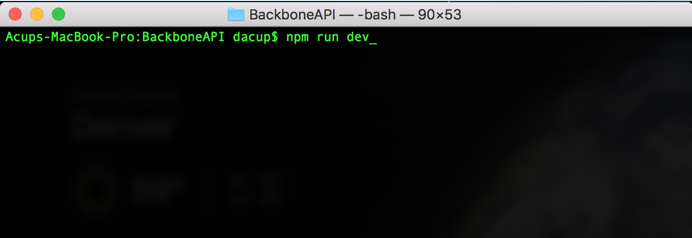

# Backbone API

Backbone API is a simple UI allowing the user to display and edit nonpersistent data on a fullstack React / Redux javascript application.


## Installing

A step by step series of examples that tell you how to get a development environment running

* Install the prerequisites on your computer

```
* Javascript
* Node.js
* Terminal (Mac) / Git Bash (PC)
```

* Use terminal / git bash to run the following commands from the root folder

```
* npm run devinstall
* npm run dev
```


## Photo examples of application setup and running

* Clone the repo from git hub ()


* Change directory into the cloned folder


* Install npm packages with ( $ npm run devinstall )


* Start application with ( $ npm run dev )




* Application running on your default web browser


## Built With

* [Javascript](https://www.javascript.com/)
* [Node.js](https://nodejs.org/en/)
* [Express.js](https://expressjs.com/)
* [Axios](https://www.npmjs.com/package/axios)
* [React.js](https://reactjs.org/)
* [Redux.js](https://redux.js.org/)

## Code Editor: 

* [Visual Studio Code](https://code.visualstudio.com/)

## Authors 

* **Dylan Acup** - [Portfolio](https://www.dylanacup.com)